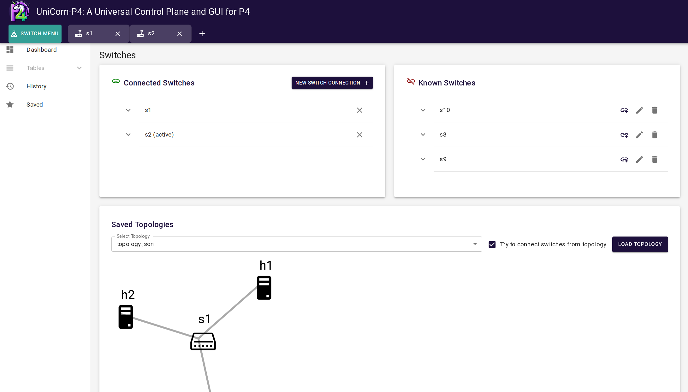

<div align="center">
 
 <h2>UniCorn-P4: A Universal Control Plane and GUI for P4</h2>

     [](https://github.com/uni-tue-kn/UniCorn-P4/actions/workflows/docker-image.yml)

</div>

- [Overview](#overview)
- [Supported Targets and Data Plane APIs](#supported-targets-and-data-plane-apis)
- [Installation \& Start Instructions](#installation--start-instructions)
- [Working with UniCorn-P4](#working-with-unicorn-p4)
  - [1. Compiling your P4 Program](#1-compiling-your-p4-program)
  - [2. Switch Configuration](#2-switch-configuration)
    - [2a. Optional: Create the virtual topology using Mininet](#2a-optional-create-the-virtual-topology-using-mininet)
    - [2b. Connecting your Switches](#2b-connecting-your-switches)
    - [3. Loading a P4 Program onto a Switch](#3-loading-a-p4-program-onto-a-switch)
    - [4. Managing MAT Entries](#4-managing-mat-entries)
- [Preview of UniCorn-P4](#preview-of-unicorn-p4)

## Overview
This repository contains the source code for a universal P4 controller for rapid prototyping of P4 programs in data plane programming.

<details open markdown='1'><summary>UniCorn-P4</summary>

* provides a web-based GUI for configuration and visualization of P4 switches
* implements a control plane communicating with switches via the data plane API
* automatically derives available MATs and their structure from compiled P4 files
* allows manual manipulation of MAT entries or loading them from configuration files
* includes a Mininet extension for emulating large network topologies to test P4 programs


## Supported Targets and Data Plane APIs
Currently any P4 target that implementes the P4 Runtime API is supported, e.g., the BMv2 software-based target with the `simple_switch_grpc` architecture.

## Installation & Start Instructions

UniCorn-P4 can be started via `docker-compose up` in the docker folder.
This docker-compose file starts up the frontend, the backend, and the Mininet container.
Place your topologies and P4 files in their corresponding folder in the `docker folder`.
Once the container has started, navigate to `localhost:3000`.

## Working with UniCorn-P4

### 1. Compiling your P4 Program
UniCorn-P4 requires the generated P4 runtime file and the intermediate representation file from the compilation command.
For convenience, the frontend features a compiler interface for the BMv2 model.

If you want to compile it manually, you can use the following command:
```bash
p4c /path/to/p4_folder/basic.p4 --target bmv2 --arch v1model --p4runtime-files /path/to/p4_folder/basic.p4info.txt -o /path/to/p4_folder/
```
You may create subfolders for distinct projects there containing your compiled P4 files.

### 2. Switch Configuration
#### 2a. Optional: Create the virtual topology using Mininet
Example topology file, placed in `docker/topologies/topology.json`:
```json
{
    "hosts": [
        "h1",
        "h2"
    ],
    "switches": {
        "s1": { },
        "s2": { }
    },
    "links": [
        ["h1", "s1"],  ["h2", "s1"], ["s1", "s2"]
    ]
}
```
Select the topology file in the GUI and click on "Load Topology".
The Mininet container will now create your virtual testbed in the background.

#### 2b. Connecting your Switches
Click on "New Switch Connection". 

If you are using the Mininet Extension, the switches loaded from the topology are automatically discovered and can be selected in the drop down menu.

Otherwise, enter the name, address, port, switch_id, and a log file path to connect to a switch in the network.

#### 3. Loading a P4 Program onto a Switch
Select a Switch in the navigation bar and click on "Edit Initialization".

Select the P4 Info file and the corresponding json file from the list of discovered files and click on "Initialize".

The P4 program is now loaded onto the switch.

#### 4. Managing MAT Entries
After the switch is initialized, the available MATs in the P4 program are automatically discovered and can be found under "Tables".

New entries can be added, and existing entries can be modified or deleted.

The current state of the switch can be saved as a snapshot into your history.

## Preview of UniCorn-P4



